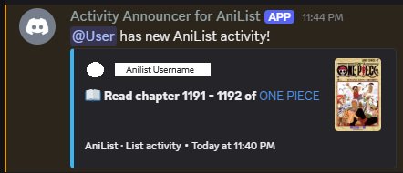

# Unofficial AniList Discord Bot

[](https://github.com/C-Agus/unofficial-anilist-discord-bot/actions/workflows/tests.yml)


A Discord bot that links Discord accounts to [AniList](https://anilist.co) profiles and posts new anime/manga activity (episode progress, completions, and status posts) as rich embeds, automatically on a schedule or on demand. It is a full rewrite of my original single-file, synchronous bot into a modular async application with encrypted storage, a rate-limited API client, and an offline test suite.

<!-- Uncomment after adding a screenshot to docs/demo.png

-->

> Not affiliated with AniList or Discord.

## Highlights

- **Encryption without losing uniqueness.** AniList usernames are Fernet-encrypted at rest, yet the database still enforces "one AniList account per Discord user." A keyed HMAC-SHA256 fingerprint sits behind a `UNIQUE` constraint, so duplicate checks never need to decrypt anything.
- **Crash-safe delivery.** Activity checkpoints live in SQLite (WAL mode) and advance only *after* Discord confirms the announcement was sent. A crash can cause at most a repeat, never a missed update.
- **Polite API client.** An async GraphQL client caps traffic at 25 requests/min (under AniList's 30/min limit) with a sliding-window limiter, retries with exponential backoff that honor `Retry-After`, and a 45-second response cache.
- **Painless upgrades.** The original bot's database schema is detected and migrated automatically, encrypting existing rows on the way.
- **Tested offline, on every push.** Smoke tests cover crypto, database CRUD, uniqueness, migration, activity parsing, embeds, and command registration, run by GitHub Actions on Python 3.10 through 3.13.

## Tech stack

Python · discord.py 2 · aiohttp · aiosqlite (SQLite) · cryptography (Fernet, HMAC-SHA256) · GitHub Actions

## Features

- **Slash commands + classic prefix commands.** Every command works as both `/checkactivity` and `!checkactivity` (hybrid commands).
- **Rich activity embeds** with cover art, status-based colors, clickable titles, the user's AniList avatar, and proper timestamps.
- **Interactive UI**: an interactive categorized `/help` menu with a dropdown, "View on AniList" link buttons, and a confirmation dialog before unlinking.
- **Persistent, restart-safe checkpoints.** Last-seen activity IDs live in SQLite, so the bot never re-announces or drops activity after a restart. Manual checks reply `No new activity since last checked.` when there's nothing new.
- **Username validation & uniqueness.** Usernames are verified against the AniList API before being stored, and one AniList account can only be linked to one Discord user (enforced by application logic *and* a database `UNIQUE` constraint, case-insensitively).
- **Encrypted at rest.** Stored AniList usernames are encrypted (Fernet) with a keyed HMAC fingerprint used for uniqueness lookups — the database file alone doesn't reveal the Discord ↔ AniList mapping.
- **Polite to the API.** Async HTTP (`aiohttp`), client-side rate limiting under AniList's request cap, automatic retries with backoff (honoring `Retry-After`), a short-lived response cache, and per-user command cooldowns.
- **Automatic migration** from the original bot's database schema — just run it against your existing `anilist_bot.db`.

## Requirements

- Python **3.10+**
- A Discord bot application (see setup below)

## Setup

### 1. Create the Discord application

1. Go to the [Discord Developer Portal](https://discord.com/developers/applications) → **New Application**.
2. Under **Bot**, copy the **Token** (this becomes `DISCORD_TOKEN`).
3. Still under **Bot → Privileged Gateway Intents**, enable **Message Content Intent** (needed only for `!`-prefix commands; slash commands work without it).
4. Under **OAuth2 → URL Generator**, select the scopes `bot` and `applications.commands`, and the permissions **View Channels**, **Send Messages**, **Embed Links**, and **Read Message History**. Open the generated URL to invite the bot to your server.

### 2. Install

```bash
git clone https://github.com/C-Agus/unofficial-anilist-discord-bot.git
cd unofficial-anilist-discord-bot
python -m venv .venv
source .venv/bin/activate        # Windows: .venv\Scripts\activate
pip install -r requirements.txt
```

### 3. Configure

```bash
cp .env.example .env
```

Fill in `.env`. Generate the encryption key with:

```bash
python -c "from cryptography.fernet import Fernet; print(Fernet.generate_key().decode())"
```

| Variable | Required | Description |
| --- | --- | --- |
| `DISCORD_TOKEN` | ✅ | Bot token from the Developer Portal. |
| `ENCRYPTION_KEY` | ✅ | Fernet key used to encrypt stored usernames. **Back it up** — if it changes, users must re-link. |
| `CHANNEL_ID` | — | Channel for automatic announcements (Developer Mode → right-click channel → Copy Channel ID). Empty = announcements off; commands still work. |
| `GUILD_ID` | — | If set, slash commands sync to that server instantly (recommended for development). Global sync can take up to an hour. |
| `FETCH_INTERVAL_MINUTES` | — | How often to poll AniList. Default `5`. |
| `COMMAND_PREFIX` | — | Prefix for classic commands. Default `!`. |
| `DB_PATH` | — | SQLite file path. Default `anilist_bot.db`. |
| `LOG_LEVEL` | — | `DEBUG`, `INFO`, `WARNING`, `ERROR`. Default `INFO`. |

### 4. Run

```bash
python bot.py
```

Tables are created (or migrated) automatically on startup — no separate setup script.

## Commands

Every command is available as a slash command (`/name`) and a prefix command (`!name`). Running a command without its required argument shows a usage example instead of failing.

| Command | Description |
| --- | --- |
| `!setusername <AniListUsername>` (alias `!link`) | Validate and link your AniList account. |
| `!updateusername <AniListUsername>` | Switch your link to a different AniList account. |
| `!removeusername` (alias `!unlink`) | Unlink your account (asks for confirmation with buttons). |
| `!whoami` (alias `!mystatus`) | Show which AniList account you've linked. |
| `!checkactivity` (alias `!activity`) | Show new activity since the last check, or `No new activity since last checked.` |
| `!help` | Interactive, categorized help with a dropdown menu. |

## Project structure

```
unofficial-anilist-discord-bot/
├── bot.py                       # Entry point: bot class, cog wiring, global error handling
├── config.py                    # Env-var loading & validation (fail-fast)
├── commands/
│   ├── account.py               # link / update / unlink / whoami
│   ├── activity.py              # checkactivity
│   └── help_command.py          # interactive help menu
├── services/
│   ├── anilist.py               # async GraphQL client: rate limiting, retries, caching, typed models
│   └── activity_monitor.py      # background loop announcing new activity
├── database/
│   └── db.py                    # async SQLite layer: schema, migration, encrypted storage
├── utils/
│   ├── crypto.py                # Fernet encryption + HMAC fingerprints
│   ├── embeds.py                # all embed builders
│   ├── views.py                 # buttons & confirmation dialogs
│   └── logging_config.py        # structured logging setup
└── tests/
    └── smoke_test.py            # offline tests: python -m tests.smoke_test
```

## Data, security & privacy

- **What's stored:** your Discord ID, your AniList username (encrypted), your AniList numeric ID, and the ID of the last announced activity.
- **Encryption at rest:** usernames are Fernet-encrypted; uniqueness is checked via a keyed HMAC-SHA256 fingerprint. Someone with only the `.db` file (and not your `ENCRYPTION_KEY`) can't read the Discord ↔ AniList mapping.
- **Key rotation caveat:** changing `ENCRYPTION_KEY` makes existing rows undecryptable. The bot logs this and skips those users; they simply need to `!setusername` again.
- **Logs** never pair Discord identities with AniList usernames.
- **Secrets** live only in `.env`, which is git-ignored. If a token or key ever leaks, regenerate it in the Developer Portal immediately.
- All SQL is parameterized; there is no string-built SQL anywhere.

## Upgrading from the original bot

Point `DB_PATH` at your existing `anilist_bot.db` (or just run in the same folder) and start the bot. The legacy schema is detected and migrated automatically: usernames are encrypted, and the first check after migration silently records a baseline instead of re-announcing old activity. Make a copy of the `.db` file first if you want a rollback path. If two Discord users had registered the same AniList username under the old bot, the earlier one keeps it and the other is asked to re-link.

`database_setup.py` from the old version is no longer needed.

## Rate limiting

The AniList client keeps itself under 25 requests/minute (AniList's public limit is currently 30/min), retries transient failures with exponential backoff, honors `Retry-After` on HTTP 429, and caches activity responses for ~45 seconds. On top of that, `checkactivity` has a 10-second per-user cooldown and linking commands are limited to 2 uses per 30 seconds.

## Testing

```bash
python -m tests.smoke_test
```

Runs fully offline: crypto round-trips, database CRUD, uniqueness enforcement, legacy migration, activity parsing, embed rendering, and command registration.

## Troubleshooting

- **Slash commands don't appear** — set `GUILD_ID` in `.env` for instant syncing to your server; global syncs can take up to an hour. Also confirm the bot was invited with the `applications.commands` scope.
- **`PrivilegedIntentsRequired` on startup** — enable *Message Content Intent* in the Developer Portal (Bot → Privileged Gateway Intents).
- **"Discord rejected the token"** — the token in `.env` is wrong or was regenerated; copy a fresh one.
- **No automatic announcements** — check that `CHANNEL_ID` is set, correct, and that the bot can view and send messages in that channel. The logs will say exactly which of these failed.

## Roadmap ideas

- Web dashboard (FastAPI + Discord OAuth2) for linking and viewing activity in the browser.
- Per-server announcement channels instead of a single global channel.
- Opt-in notification preferences (e.g., list activity only, no text posts).
- Refresh already-posted embeds with new likes and comments during the recurring API pulls.

## License

[MIT](LICENSE)
